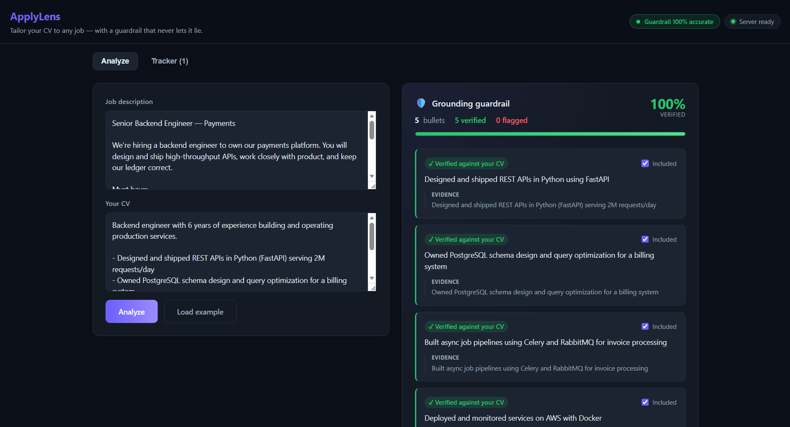

# ApplyLens 🔎

An AI copilot for the job hunt. Paste a job description and your CV, and ApplyLens:

1. **Extracts** the posting into structured requirements (must-haves, nice-to-haves, stack)
2. **Scores your fit** against the role — strictly evidence-based (matched / partial / missing)
3. **Tailors** resume bullets + a cover letter, **grounded** in your real CV
4. **Guards against fabrication** — a grounding check flags any generated claim your CV doesn't support
5. **Grounds the cover letter too** — it extracts only the letter's factual claims about your background and checks those against your CV (boilerplate like greetings and "I'm excited to apply" is never flagged)



It's a **workspace, not a chat box** — three things a raw ChatGPT/Claude paste structurally can't give you:
- **Trust you can see** — every tailored bullet is labeled *"verified against your CV"* (with the evidence) or *"not supported"* (with the reason). Chat will happily invent "Led a team of 8 at Google"; ApplyLens flags it.
- **A workflow across many jobs** — analyses are saved to a tracker and moved applied → interviewing → offer. Chat loses everything on refresh.
- **Measured accuracy** — the guardrail is graded by an eval harness: **100% accuracy / 100% fabrication recall on a labeled set (n=33)**, surfaced in the UI. Chat gives you vibes; this gives you a number.

Built as a real tool *and* a showcase of applied-AI engineering: structured LLM extraction, LLM-as-judge scoring, grounded generation, a user-facing anti-hallucination **guardrail**, an **eval harness** with precision/recall, and a polished dark SaaS UI with cold-start-aware UX.

## Architecture

```
React (Vite)  ──►  FastAPI  ──►  Groq (OpenAI-compatible LLM)
                     │
   /api/extract  ──  extract.py     JD text     → structured requirements
   /api/fit      ──  fit.py         JD + CV     → evidence-based fit score
   /api/tailor   ──  tailor.py      JD + CV     → tailored bullets + cover letter
                        └── grounding.py  each bullet → supported? (guardrail)
evals/run_evals.py     grounding guardrail → accuracy + fabrication precision/recall
```

## Tech stack

**Backend:** Python · FastAPI · httpx · Groq (`llama-3.3-70b-versatile`)
**Frontend:** React + Vite
**Evals:** labeled JSONL dataset + a runnable scorer

## Run it

**Backend**
```bash
cd backend
python -m venv .venv && source .venv/bin/activate
pip install -r requirements.txt
cp .env.example .env          # add your free Groq key: https://console.groq.com/keys
./start.sh                    # http://localhost:8000  (docs at /docs)
```

**Frontend**
```bash
cd frontend
npm install
npm run dev                   # http://localhost:5173 (proxies /api to :8000)
```

**Tests & evals**
```bash
cd backend && pytest                       # smoke tests (no key needed)
GROQ_API_KEY=... python evals/run_evals.py # grounding guardrail metrics
```

## API

| Endpoint | Body | Returns |
|---|---|---|
| `GET /health` | — | `{"status":"ok"}` |
| `POST /api/extract` | `{jd_text}` | structured requirements |
| `POST /api/fit` | `{jd_text, cv_text}` | `overall_score`, matched/partial/missing, summary |
| `POST /api/tailor` | `{jd_text, cv_text}` | `bullets`, `cover_letter`, `grounding[]`, `flagged_count`, `cover_grounding[]`, `cover_flagged_count` |
| `POST /api/analyze` | `{jd_text, cv_text}` | `{job, fit, tailor}` — runs all three concurrently in one call |
| `POST /api/regenerate-bullet` | `{jd_text, cv_text, bullet, issue}` | `{bullet, grounding}` — self-correcting loop: regenerate one flagged bullet conditioned on its failure reason, then independently re-verify it |

### Self-correcting guardrail loop

`/api/regenerate-bullet` closes the loop from **detection → repair → re-verification**.
When the guardrail flags a bullet as fabricated, its machine-readable `issue`
is fed back into a scoped, constraint-conditioned regeneration of that single
bullet, and the **new** bullet is then re-graded by the same fact-checker
(`check_grounding`) — never trusting the generation step. It self-corrects with
one bounded retry, then degrades honestly: if the CV genuinely can't support the
claim, the card stays flagged instead of fabricating a green.

## Roadmap

- "Fix all flagged bullets" batch action (single-bullet fix ships today)
- Export the tailored resume + cover letter (PDF / Markdown)
- Embedding-based retrieval over CV bullets (pgvector) for larger CVs
- Server-side persistence (Postgres) + a per-provider LLM fallback

## Development team (subagents)

This repo defines a small agent team under `.claude/agents/` — `product-manager`,
`developer`, `qa-tester`, and `bug-fixer` — used to plan, build, test, and fix
features. See each file for its role and scope.
